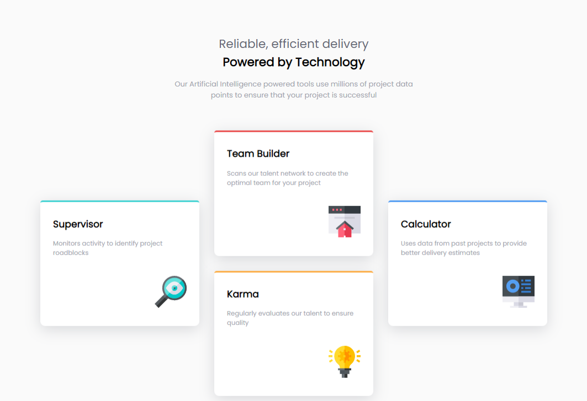

# Frontend Mentor - Four card feature section solution

This is a solution to the [Four card feature section challenge on Frontend Mentor](https://www.frontendmentor.io/challenges/four-card-feature-section-weK1eFYK). Frontend Mentor challenges help you improve your coding skills by building realistic projects.

## Table of contents

- [Overview](#overview)
  - [The challenge](#the-challenge)
  - [Screenshot](#screenshot)
  - [Links](#links)
- [My process](#my-process)
  - [Built with](#built-with)
  - [What I learned](#what-i-learned)
  - [Useful resources](#useful-resources)
- [Author](#author)

## Overview

### The challenge

Users should be able to:

- View the optimal layout for the site depending on their device's screen size


### Screenshot



### Links

- Solution URL: [Add solution URL here](https://your-solution-url.com)
- Live Site URL: [Add live site URL here](https://your-live-site-url.com)

## My process

### Built with

- Semantic HTML5 markup
- CSS custom properties
- CSS Grid
- Mobile-first workflow

### What I learned

I learned about new grid properties and also how to make grid responsive in any device in this challenge.

See the code snippets below:

```css
main .card {
  font-size: 0.8rem;
  padding: 1em 2em;
  background-color: white;
  margin-bottom: 2em;
  border-top: 4px solid;
  border-radius: 5px 5px 10px 10px;
  box-shadow: hsla(234, 12%, 34%, 0.2) 0px 7px 29px 0px;
  clear: both;
  overflow: hidden;
}

main {
  display: grid;
  grid-template-areas:
    "...... card-2 ......"
    "card-1 card-2 card-4"
    "card-1 card-3 card-4"
    "...... card-3 ......";
  justify-content: center;
  grid-auto-columns: minmax(minmax(0, 1fr), max-content);
  gap: 2em;
}
```

### Useful resources

- [Preventing a Grid Blowout](https://css-tricks.com/preventing-a-grid-blowout/) - This helped me solve grid items overflowing from their container.

## Author

- Frontend Mentor - [@azizp128](https://www.frontendmentor.io/profile/azizp128)
- Twitter - [@azizprbw](https://www.twitter.com/azizprbw)
